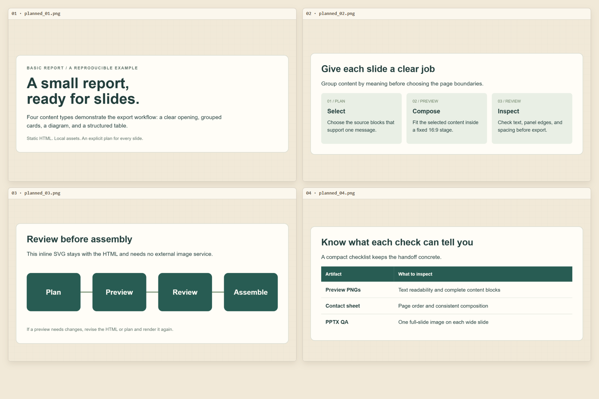

# HTML to PPT Deck Export

A Codex skill and standalone Node scripts for turning planned HTML content into
image-based, 16:9 PowerPoint decks.

**Plan the slides, inspect the previews, then assemble the PPTX.**

## Why this project exists

Screenshot-based HTML-to-PPT workflows can produce tiny text, excessive margins,
poor pagination, clipped panels and inconsistent slide composition. A long web
page rarely maps cleanly to presentation slides.

This project makes page boundaries explicit in a slide plan. It renders selected
HTML blocks inside a fixed stage, provides PNG previews and a contact sheet for
review, and assembles accepted images into full-slide PowerPoint pages. Layout
quality still depends on the source, the plan and visual inspection.

## Key features

- Select complete blocks, chapter blocks or subsets of direct children.
- Control scaling, margins, vertical placement, cropping and export-only CSS.
- Render numbered previews and a numeric-order contact sheet.
- Replace, split or merge approved preview pages using replacement rules.
- Assemble one full-slide PNG per PowerPoint slide.
- Check picture count, slide dimensions and full-bleed placement with Windows QA.

The output preserves the rendered appearance. Text, tables and diagrams become
pixels inside the slide image; they are not individually editable PowerPoint objects.

## Demo

The [basic report example](examples/basic-report/README.md) contains text, cards,
an inline SVG diagram and a table. This contact sheet was generated from its
HTML and slide plan:

The source and plan are committed. Full preview sets, local manifests and PPTX
files stay in ignored output directories; reviewed decks can accompany GitHub
Releases. The small contact sheet serves as the documentation demo.

## Quick start

For the complete workflow, use **Windows**, **Node 22 or Node 24.13.1+ within the
24 series** (a current Node 24 patch is recommended), npm and Windows PowerShell.

    git clone https://github.com/van822/html-to-ppt-deck-export.git
    cd html-to-ppt-deck-export
    npm ci
    npx playwright install chromium
    npm run preview -- examples/basic-report/report.html examples/basic-report/slide_plan.json outputs/basic-report/previews
    npm run contact-sheet -- outputs/basic-report/previews outputs/basic-report/contact_sheet.png 2

**Open the contact sheet and individual previews.** Check readability, complete
content, page order and margins. Adjust the plan or HTML and render again as needed.
After accepting the previews:

    npm run pptx -- outputs/basic-report/previews outputs/basic-report/basic-report.pptx
    npm run qa -- outputs/basic-report/basic-report.pptx

Expect four slides and a QA report with badCount equal to zero. That result checks
PPTX structure; visual acceptance happens before assembly.

The preview command clears its output directory. Choose a new directory when
retaining an accepted version. Do not use a source or project directory as output.

## Install as a Codex skill

In Codex, ask the built-in installer:

    $skill-installer install the skill from https://github.com/van822/html-to-ppt-deck-export/tree/main/skills/html-to-ppt-deck-export

Codex detects installed skills; restart if it does not appear. See the
[official skill documentation](https://learn.chatgpt.com/docs/build-skills).

The installer copies the skill folder, not the root npm project or browser.
Also clone this repository and run npm ci and npx playwright install chromium.
Open Codex in that repository root when invoking the installed skill so its
scripts can resolve the locked dependencies through the working directory.
Keep the skill copy and repository checkout at matching revisions when updating.

Example prompt:

    Use $html-to-ppt-deck-export for this HTML report.
    Inspect the source, write an explicit slide plan, render 16:9 previews,
    review the contact sheet, iterate as needed, assemble the accepted
    previews into PPTX, and run the full-bleed QA.

The scripts retain dependency lookup from their own location, the active
workspace, the legacy work/html_to_ppt workspace subdirectory and global npm
modules. Clean installation uses the repository lockfile; global modules are
not required and should not be used for reproducibility checks.

## Manual workflow

Run these scripts from the repository root with your own inputs.

1. **Inspect HTML and write the plan.** Split dense sections or merge sparse ones
   according to their content before rendering.
2. **Generate previews:**

       node skills/html-to-ppt-deck-export/scripts/export_preview.js source.html slide_plan.json outputs/previews

3. **Create and inspect the contact sheet:**

       node skills/html-to-ppt-deck-export/scripts/make_contact_sheet.js outputs/previews outputs/contact_sheet.png 4

4. **Iterate.** Edit source/plan and render again, or replace approved pages:

       node skills/html-to-ppt-deck-export/scripts/replace_preview_pages.js outputs/previews outputs/previews_v2 rules.json

   Add --force to replace an existing output directory. Unsafe input/output
   overlaps are rejected. Image paths are relative to the rules file. Operations
   refer to 1-based original positions and run from highest start downward.

       {
         "replace": [
           { "start": 2, "deleteCount": 2, "images": ["approved-merged-page.png"] }
         ]
       }

   This merges original pages 2 and 3 into one supplied image. Outputs are
   renumbered from planned_01.png. Legacy replacements, remove and image aliases
   remain supported. Review a new contact sheet:

       node skills/html-to-ppt-deck-export/scripts/make_contact_sheet.js outputs/previews_v2 outputs/contact_sheet_v2.png

5. **Assemble accepted previews:**

       node skills/html-to-ppt-deck-export/scripts/ppt_from_preview.js outputs/previews_v2 outputs/deck.pptx

   If no replacement was needed, use outputs/previews as the input directory.

6. **Run final structural QA:**

       node skills/html-to-ppt-deck-export/scripts/qa_pptx_full_bleed.js outputs/deck.pptx

QA exits with 0 for success, 1 for input/runtime failure and 2 for layout failure.
Its JSON retains pptx, slides, badCount and bad. Contact-sheet and PPTX scripts
consume only numbered planned_*.png files, ordered numerically.
Equivalent npm aliases are preview, contact-sheet, replace-previews, pptx and qa;
put script arguments after --.

### Layout troubleshooting

- **Tiny text:** split the slide or reduce content density.
- **Too much empty space:** narrow the raw width, raise the enlargement cap,
  or merge compatible content. Recheck text and margins.
- **Clipped panels:** lower maxScale, increase padding or split content.
- **Uneven screenshot evidence:** separate images with different heights or
  rebalance them; retain captions and labels in final slide order.
- **Browser missing:** run npx playwright install chromium. Rendering scripts
  retain an installed Microsoft Edge fallback; CI uses pinned Chromium.
- **PPTX differs from previews:** run QA and verify the correct preview directory
  was used. Defects already in PNGs need changes before assembly.

## How it works

    HTML → slide plan → fixed 16:9 previews → contact-sheet QA
         → iteration → PPTX → final QA

Playwright opens local HTML and clones selected DOM blocks into a fixed stage.
It fits and optionally crops each composition, then records PNGs and a preview
manifest. After contact-sheet review, PptxGenJS places accepted PNGs onto wide
slides. PowerShell QA reads the PPTX ZIP/XML and checks picture geometry.

Default staging is 1600×900 CSS pixels with deviceScaleFactor 2, producing
3200×1800 for a full-stage screenshot. Default content cropping can produce
smaller images with approximately the same aspect ratio, allowing for integer
rounding. The example uses scale factor 1 and noCrop for fixed 1600×900 PNGs.

## Slide-plan overview

    {
      "stage": { "width": 1600, "height": 900, "deviceScaleFactor": 2 },
      "blockSelector": "main > section",
      "slides": [{
        "name": "Opening",
        "fit": { "width": 1260, "maxScale": 1.2, "padX": 40, "padY": 40, "topBias": 0.5 },
        "items": [{ "type": "full", "block": 1 }]
      }]
    }

| Control | Behavior |
| --- | --- |
| block / selector | 1-based block index or explicit CSS selector; selector takes precedence |
| full / chapter | Clone the whole block; chapter adds an export class |
| partial | Clone selected direct children; prefixChildren defaults to [1, 2, 3] |
| width, shortWidth, mediumWidth | Raw width and optional narrower widths for short content |
| maxScale, padX, padY, topBias | Enlargement cap, margins and vertical placement |
| cropX, cropY, minClipW, noCrop | Crop padding, minimum width, or full-stage capture |
| className, exportCss | Per-slide class hook and plan-level CSS overrides |

See [SKILL.md](skills/html-to-ppt-deck-export/SKILL.md) for the reference and visual
checklist. Keep the stage at 16:9. Comprehensive schema validation and automatic
overflow detection are future work.

## Examples

- [Basic report](examples/basic-report/README.md): offline source, all commands,
  expected dimensions and artifact guidance.
- [Slide plan](examples/basic-report/slide_plan.json): index, selector and partial
  selection with full-stage capture.

## Repository structure

    .github/                              CI, Issue forms and PR template
    examples/basic-report/                HTML, slide plan and instructions
    docs/assets/                          Reviewed demo contact sheet
    scripts/check.js                      Syntax and JSON checks
    skills/html-to-ppt-deck-export/
      SKILL.md                            Workflow and plan reference
      agents/openai.yaml                  Codex display metadata
      scripts/                            Five commands and internal helpers
    tests/{unit,pipeline,integration}/     Node test runner suites
    package.json, package-lock.json        Pinned installation and npm commands
    AGENTS.md, CONTRIBUTING.md             Agent and contributor guidance
    ROADMAP.md, CHANGELOG.md, LICENSE      Maintenance and licensing

## Compatibility

- **Release target:** Windows, Node 22 or Node 24.13.1+ in the 24 series, npm and
  Windows PowerShell. CI exercises Node 22 and 24 on Windows. Earlier Node 24
  patches can fail to clear Unicode paths; see the
  [Node 24.13.1 fix](https://nodejs.org/en/blog/release/v24.13.1).
- **Browser:** Playwright Chromium is the reproducible path. Edge fallback is
  retained. Source fonts must be available locally.
- **Other platforms:** full Linux/macOS support is not claimed; QA invokes
  powershell.exe.
- **PowerPoint:** output is image-based wide OOXML. No certification across
  PowerPoint versions or office viewers is claimed.
- **Source material:** use trusted HTML and available assets. The exporter
  executes the page in a browser. Keep private data out of public issues.
- **QA limits:** automated checks do not judge readability, clipping or meaning.
- **Dependency advisories:** npm audit reports high-severity
  [ICNS](https://github.com/advisories/GHSA-w3rx-r6r6-pgpr) and
  [JXL/HEIF](https://github.com/advisories/GHSA-5p2g-fcmc-qvqq) parser advisories in
  image-size, a transitive dependency of pinned pptxgenjs 4.0.1. These remain
  unresolved in this dependency tree. Review before publishing; npm audit fix
  --force proposes an incompatible PptxGenJS downgrade.

## Roadmap

v0.1 establishes installation, examples, regression tests and Windows CI.
Planned v0.2 work covers slide-plan validation, overflow detection and layout
diagnostics. Planned v0.3 work covers consolidated QA reports, a unified CLI and
batch/headless improvements. See [ROADMAP.md](ROADMAP.md).

## Contributing

See [CONTRIBUTING.md](CONTRIBUTING.md) for test layers and PR expectations. Start
with a minimal reproduction or concrete workflow need in the
[Issue tracker](https://github.com/van822/html-to-ppt-deck-export/issues).

    npm run check
    npm test
    npm run test:integration

## License

[MIT](LICENSE), copyright 2026 van822. Third-party dependencies retain their
respective licenses.
